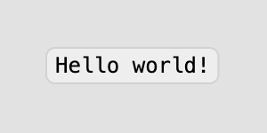

# tds-shapes

User interface components created with [svg.js](https://github.com/svgdotjs/svg.js)

## Usage example

`git clone https://github.com/e2sence/tds-shapes.git`

add entry point

```typescript
import * as shape from './src/tds-shapes/tds-shapes-entry'
```

adds [svg.js](https://svgjs.com/docs/3.0/getting-started/) canvas:

```typescript
let draw = SVG().addTo('body').size(300, 300)
```

lets create simple label:

```typescript
/**
 * creating a label with the specified properties
 * @param s text on label
 * @param p position
 */
const lm = (s: string, p: { x: number; y: number }) => {
  return new shape.label({
    title: {
      value: s,
      font: 'Menlo',
      fontWeight: 'normal',
      size: 12,
      fill: { color: 'black' },
      position: { x: 0, y: 0 },
    },
    background: {
      width: 5,
      height: 5,
      fill: { color: '#EEEEEE' },
      stroke: { color: '#D2D2D2', width: 1 },
      radius: 5,
      position: { x: 0, y: 0 },
    },
    backgroundRule: ['indent'],
    indents: [5, 3, 5, 3],
    position: { x: p.x, y: p.y },
  }).draggable()
}

draw.add(lm('Hello world!', { x: 40, y: 50 }))
```


